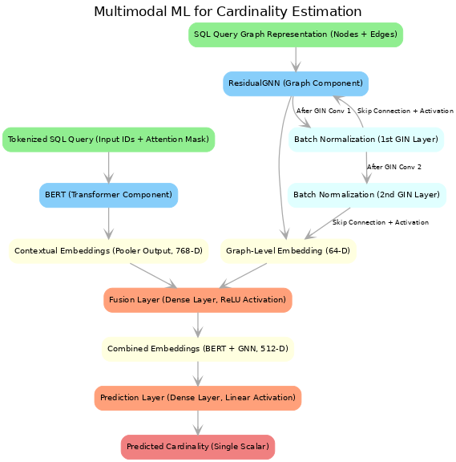

# Multimodal Machine Learning for SQL Cardinality Estimation

## Overview

For a detailed explanation of the project, you can refer to the [Project Report](Cardinality%20Estimation%20Using%20Multimodal%20ML.pdf).

This project presents a hybrid model for SQL cardinality estimation, combining a transformer-based approach (BERT) and a Graph Neural Network (ResidualGNN). The objective is to enhance the accuracy of cardinality estimation by leveraging both the structural representation and the contextual information of SQL queries, thus contributing to more efficient query processing in database management systems.

## Features

- **Hybrid Multimodal Approach**: Combines query structure (GNN) and context (BERT) for improved cardinality estimation.
- **End-to-End Trainable Pipeline**: Integrates query parsing, feature extraction, and prediction within a single architecture.
- **Extensible to Additional Modalities**: Includes plans to integrate database characteristics as a third modality.

## Installation

To run this project, create a virtual environment and install the dependencies using the provided `requirements.txt` file:

```bash
python3 -m venv venv
source venv/bin/activate
pip install -r requirements.txt
```

## Usage

1. **Model Training**: Train the model by providing a set of SQL queries as input. The training pipeline parses each query into a graph representation for the GNN and tokenizes the text for the transformer.

2. **Inference**: Estimate cardinalities for new SQL queries by using the trained model.


## Directory Structure

- **`Predict_Cardinalities.ipynb`**: Jupyter notebook demonstrating the use of the model for predicting cardinalities.
- **`query_cardinalities.csv`**: Sample dataset used for testing and training.
- **`SQLCardinalityEstimatorArchitecture.png`**: Visual representation of the model architecture.
- **`requirements.txt`**: List of all dependencies needed for the project.

## Model Architecture



- **Transformer (BERT)**: Processes the tokenized SQL query to provide contextual embeddings.
- **ResidualGNN**: Converts the SQL query into a graph representation, capturing the structure and relationships.
- **Fusion Layer**: Combines features from both the GNN and transformer components to form a holistic representation.
- **Prediction Layer**: Outputs the estimated cardinality based on the fused features.

## Dataset

We used the **JoinGym dataset** for training and testing purposes. For more details, refer to [JoinGym Dataset](https://github.com/kaiwenw/JoinGym/blob/main/README.md).

## Preliminary Results

- A test split of 15% was used on approximately 3300 unique samples.
- Training accuracy with R² > 0.8 led to significant overfitting, resulting in a test R² < 0.3.
- Constraining training accuracy to R² between 0.70 and 0.75 resulted in a more balanced performance, with a test R² score of around 0.53.

## Future Directions

- **Third Modality Integration**: We plan to incorporate database characteristics (e.g., table sizes, data distributions) as a third modality to further enhance cardinality prediction accuracy.
- **Synthetic Data Generation**: We aim to use the model's understanding of data relationships to generate realistic synthetic datasets for testing and benchmarking purposes.
- **Broader Evaluation**: The model will be tested on additional datasets to ensure robustness and adaptability to various types of queries and database systems.

## Acknowledgments

- **Dr. Laurent Bindschaedler, Research Group Leader** (MPI-SWS)
- **Parimarjan Negi** (MIT PhD)

## License

This project is licensed under the MIT License - see the LICENSE file for details.

## Questions?

If you have suggestions or feedback, feel free to open an issue or contact abhinitmahajan@cmu.edu directly.
